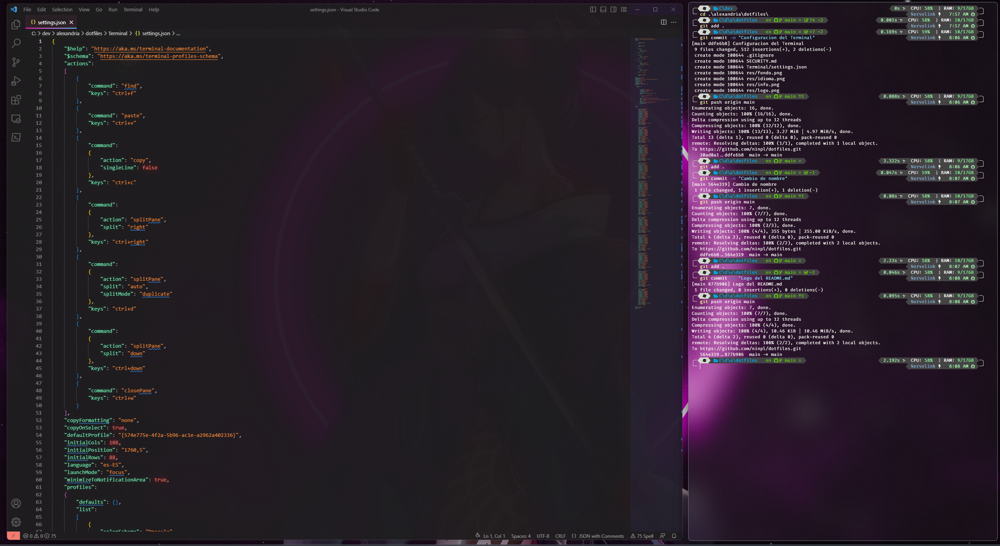
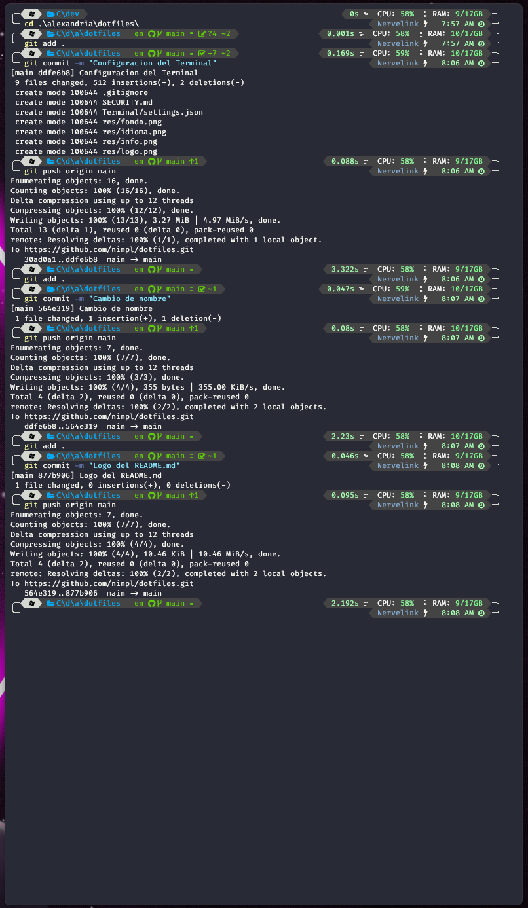

<div align="center">

```ocaml
NUNCA OMITIR / IGNORAR / EVITAR LEERME
```

</div>

<h1 align="center">
  <br>
    <a href="https://github.com/ninpl/dotfiles"></a>
      <br>
      dotfiles
  <br>
</h1>

<p align="center">
  <a href="https://releases.ubuntu.com/20.04/">
    
  </a>
  <a href="https://www.microsoft.com/es-es/software-download/windows11">
    
  </a>
</p>

<pre align="center">
  <a href="#configuracion">CONFIGURACION</a> • <a href="#dependencias">DEPENDENCIAS</a> • <a href="#descargar">DESCARGAR</a> • <a href="#colaboradores">COLABORADORES</a> • <a href="#licencia">LICENCIA</a>
</pre>
<h1>
  <a href="#--------">
    
  </a>
</h1>

<p align="center">
  <sup>
      
      <sup>
            Español,
            <strike>Ingles</strike>,
            <strike>Chino (中文)</strike>
      </sup>
  </sup>
</p>

<p align="center">
  
</p>

<p align="center">
  <em>Una captura de mi VS Code y la terminal de <a href="https://learn.microsoft.com/es-es/windows/terminal/">windows</a>.</em>
</p>

## :octocat: ‎ <sup><sub><samp>¡HOLA! ¡GRACIAS POR VENIR!</samp></sub></sup>


     
Este repo contiene la configuración que uso personalmente para mi entorno de trabajo. Algunas configuraciones son de Linux y otras de Windows. Solo queria tener un repo dotfile por si necesitaba restaurar o cambiar mi entorno, por lo que no explicare mucho, pero si tienes dudas hazmelo saber.

La mayoría fueron escritos desde cero. Algunos detalles:
- **Window Manager** : [Komorebi](https://github.com/LGUG2Z/komorebi) con [AutoHotkey](https://github.com/AutoHotkey/AutoHotkey)!
- **Barra Estado** : [Yasb](https://github.com/DenBot/yasb) unido a [Komorebi](https://github.com/LGUG2Z/komorebi)!
- **IDE Principal** : [Rider](https://www.jetbrains.com/es-es/rider/) con [ReSharper](https://www.jetbrains.com/es-es/resharper/)!
- **IDE Secundario** : [Clion](https://www.jetbrains.com/es-es/clion/) con [ReSharper C++](https://www.jetbrains.com/es-es/resharper-cpp/)!
- **Motor Videojuegos** : [Unity](https://unity.com/) con tema oscuro!
- **Terminal (Emulador)** : [Terminal](https://github.com/microsoft/terminal) con tema dark!
- **Shell** : [Powershell](https://learn.microsoft.com/es-es/powershell/scripting/install/installing-powershell-on-windows?view=powershell-7.3) con [Oh My Posh](https://ohmyposh.dev/)!
- **Lanzador Apps** : [Flow Launcher](https://github.com/Flow-Launcher/Flow.Launcher) con plugins!
- **Visualizador** : [Quick Look](https://github.com/QL-Win/QuickLook) con plugins!

En Linux:
- **Window Manager** : [Yabai](https://github.com/koekeishiya/yabai) con [AutoHotkey](https://github.com/AutoHotkey/AutoHotkey)!
- **Terminal (Emulador)** : [Fluent Terminal](https://github.com/felixse/FluentTerminal) con tema dual!
- **Shell** : [Zsh](https://www.zsh.org/) con [oh-my-zsh](https://ohmyz.sh/) framework!
- **Git UI** : [Lazygit](https://github.com/jesseduffield/lazygit)!

---

Algunas de estas configuraciones, tienen altas dependencias. Recomiendo antes de copiar leer la seccion de dependencias para que no se rompa nada. Algunos archivos tienen las rutas parcheadas para modificarlas a mano, por ejemplo las rutas de los alias, es recomendable borrarlas o cambiarles la ruta.

Se libre de clonar el repositorio y modificar todo lo que te venga mejor. Normalmente actualizo cada año mi entorno, por lo que tambien se actualizara este repositorio.

<div align="center">

```ocaml
CLIC O TOQUE ❲☰❳ PARA VER EL ESPEJO
```

</div>
<p align="right">
  [<a href="https://gitlab.com/ninpl/dotfiles">espejo</a>]
</p>

## <samp>Configuracion</samp>

```powershell
git clone https://github.com/ninpl/dotfiles.git
```

```powershell
mkdir $Env:USERPROFILE\.config -ea 0
```
```powershell
mkdir -p ~/.config/komorebi
```
```powershell
winget install LGUG2Z.whkd
```
```powershell
winget install LGUG2Z.komorebi
```
```powershell
iwr https://raw.githubusercontent.com/ninpl/dotfiles/main/komorebi/komorebi.generated.ps1 -OutFile $Env:USERPROFILE\.config\komorebi\komorebi.generated.ps1
```
```powershell
iwr https://raw.githubusercontent.com/ninpl/dotfiles/main/komorebi/komorebi.ps1 -OutFile $Env:USERPROFILE\.config\komorebi\komorebi.ps1
```
```powershell
iwr https://raw.githubusercontent.com/ninpl/dotfiles/main/whkd/whkdrc -OutFile $Env:USERPROFILE\.config\whkdrc
```
```powershell
komorebic start --await-configuration
```

## <samp>Dependencias</samp>

| Nombre                                                                                                 | Version                                                              | Licencia |
|:-----------------------------------------------------------------------------------------------------------|:---------------------------------------------------------------------|:------------------------------|
| [Post-Processing](https://docs.unity3d.com/Packages/com.unity.postprocessing@2.2/manual/Installation.html)                       | 2.2 | [U-P-D-L 1.0](https://unity.com/legal/licenses/unity-package-distribution-license)    |
| [kevinhong-ffvii](https://www.kevinhong.com/ffvii-church)             | 1.0 | [CC BY-NC-SA 4.0](https://creativecommons.org/licenses/by-nc-sa/4.0)    |
  
## <samp>Descargar</samp>

Puede [descargar](https://github.com/ninpl/dotfiles/releases) la última versión instalable de **dotfiles**. 
  
## <samp>Colaboradores</samp>

1. ¡Bifurcalo!
2. Crea tu rama de características: `git checkout -b nueva-funcion`
3. Confirme sus cambios: `git commit -am 'Agregar funcionalidad'`
4. Empuje la rama: `git push origin nueva-funcion`
5. Envíe una pull request: D

El proyecto esta mantenido por [N9+](https://github.com/ninpl) con ayuda de los colaboradores ([lista](https://github.com/ninpl/dotfiles/graphs/contributors)).

<a href="https://github.com/ninpl/dotfiles/graphs/contributors">
  
</a>

## <samp>Agradecimientos</samp>

|           |   | Inspiración y Recursos     |         |    Licencia        |
|:---------:|:-:|:-------------------------------|:--------------------|:----------:|
|  Readme | 1 | [Harry Kurn](https://github.com/owl4ce)  |   |   [GPL-3.0](https://github.com/owl4ce/dotfiles/blob/ng/LICENSE)         |
|  contributors-img  | 2 | [Suguru Inatomi](https://github.com/lacolaco)         |   | Sin Licencia |
|  Shields  | 3 | [Thaddée Tyl](https://github.com/espadrine)         |   | [CC0 LICENSE](https://github.com/badges/shields/blob/master/LICENSE) |

## <samp>Politica de seguridad</samp>

[Leer](./SECURITY.md).

## <samp>Licencia</samp>

<pre align="center">
  <a href="https://github.com/ninpl/dotfiles/blob/main/LICENSE">MIT</a> • <a href="https://ninpl.com">ninpl.com</a> • <a href="https://github.com/ninpl">@ninpl</a>
</pre>

<pre align="center">
  <a href="#readme">VOLVER ARRIBA</a>
</pre>
